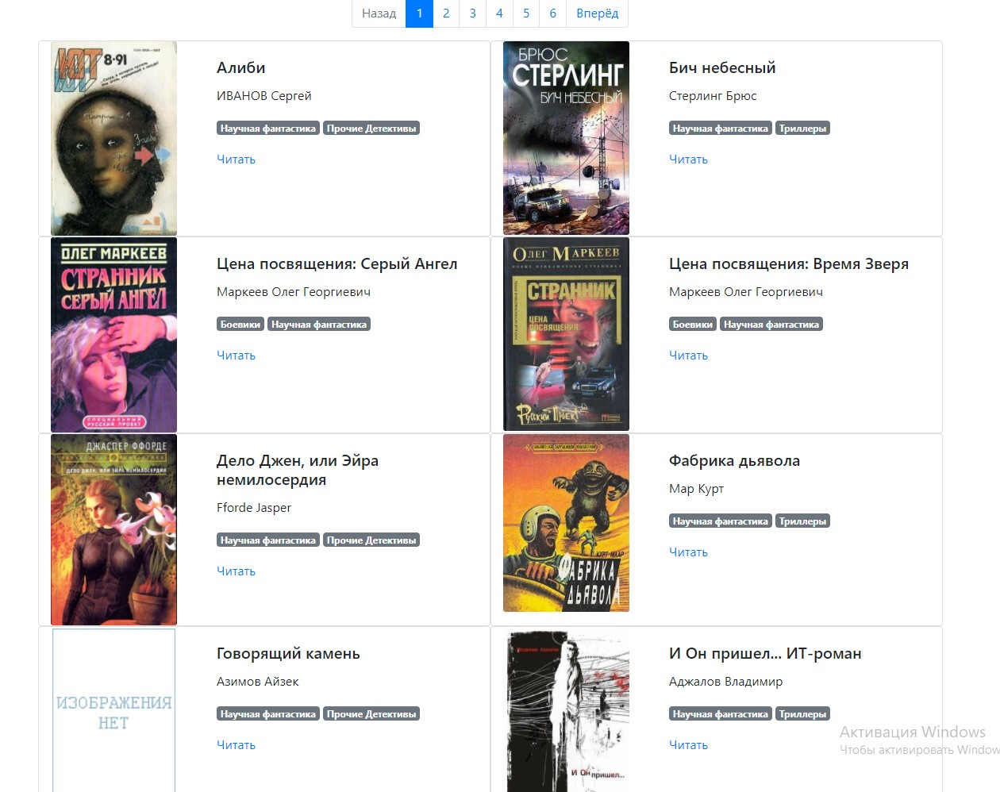

# Online Library



This code is the library of books. 

Site use `Bootstrap`. You can use it both online and offline.
 
The source of books is [tululu.org](http://tululu.org/) - a free library with electronic books. 
    
### How to use

The site was deployed in the `Github Pages`.

Open [first page](https://kirillyabl.github.io/OnlineLibrary/pages/index1.html) of library.

### How to install

Python3 should be already installed. 
Then use `pip` (or `pip3`, if there is a conflict with Python2) to install dependencies:
```
pip install -r requirements.txt
```

### How to upload more books on me local version of site

Download instructions in [this](https://github.com/KirillYabl/tululu_parser) repository.

Tne next steps are:
1. Move texts of books in `data/books` folder
2. Move images of books in `data/images` folder
3. Move short description of books `books_info.json` in `data` folder

Open command line (in windows `Win+R` and write `cmd` and `Ok`). Go to directory with program or write in cmd:

```sh
python render_website.py
```

Pages will be recreated and you can open same page in the `pages` folder.

### How to use locally

1. Use instruction `How to install`
2. Open command line (in windows `Win+R` and write `cmd` and `Ok`)
3. Go to directory with program
4. Write the next code
    ```sh
    python render_website.py
    ```
5. Open some page from `pages` directory

### References

- [tululu.org](http://tululu.org/)

- [Boostrap](https://getbootstrap.com/)

### Project Goals

The code is written for educational purposes on online-course for web-developers [dvmn.org](https://dvmn.org/).
